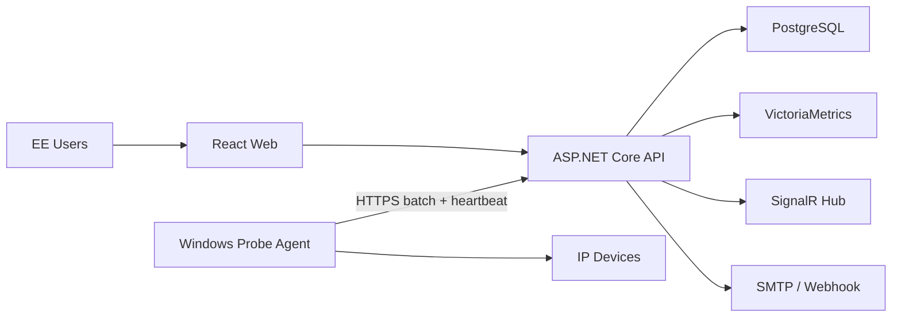

# EE Pulse MVP — Technical Specification

## 1. System context



## 2. Repository layout

```text
ee-pulse/
  src/
    backend/
      EePulse.sln
      EePulse.Api/
      EePulse.Application/
      EePulse.Domain/
      EePulse.Infrastructure/
      EePulse.Contracts/
      EePulse.Worker/
    agent/
      EePulse.Agent/
      EePulse.Agent.Core/
      EePulse.Agent.Infrastructure/
    web/
      src/
      tests/
  tests/
    EePulse.UnitTests/
    EePulse.IntegrationTests/
    EePulse.Agent.Tests/
    e2e/
  deploy/
    compose/
    agent/
    reverse-proxy/
  docs/
    adr/
    api/
    runbooks/
  scripts/
  .env.example
  docker-compose.yml
  README.md
```

## 3. Component responsibilities

### API

- Authentication and authorization
- Device, Site, Probe, Agent, and Maintenance CRUD
- Configuration-version publication
- Result-batch validation and ingestion
- Query APIs and SignalR updates
- OpenAPI publication

### Application Worker

- Status-transition processing
- Incident lifecycle
- Notification delivery and retry
- Retention and downsampling jobs
- Agent-offline detection

### Agent

- Enrollment and identity
- Configuration synchronization
- Deterministic-jitter scheduling
- ICMP execution
- Local SQLite queue
- Batch upload and retry
- Heartbeat and self-metrics

### PostgreSQL

- Source of truth for configuration and workflow data
- Not the primary time-series store for every raw packet result

### VictoriaMetrics

- Raw probe metrics and aggregate series
- Chart and report queries

## 4. Domain entities

### Site

```text
Id UUID PK
Code varchar unique
Name varchar
Timezone varchar
Enabled bool
CreatedAt timestamptz
UpdatedAt timestamptz
RowVersion bigint
```

### Device

```text
Id UUID PK
SiteId UUID FK
Name varchar
Hostname varchar nullable
Address inet
DeviceType varchar
Area varchar nullable
Owner varchar nullable
Criticality enum: Low, Normal, High, Critical
Tags jsonb
Enabled bool
CreatedAt timestamptz
UpdatedAt timestamptz
RowVersion bigint
```

### Probe

```text
Id UUID PK
DeviceId UUID FK
AgentGroupId UUID FK
Type enum: Icmp
IntervalSeconds int
TimeoutMilliseconds int
AttemptCount int
WarningRttMilliseconds int nullable
CriticalRttMilliseconds int nullable
FailureThreshold int
RecoveryThreshold int
Enabled bool
Parameters jsonb
ConfigVersion bigint
```

### Agent

```text
Id UUID PK
AgentGroupId UUID FK
Name varchar
MachineName varchar
Version varchar
Status enum: Pending, Online, Offline, Revoked
LastHeartbeatAt timestamptz nullable
LastAppliedConfigVersion bigint
CertificateThumbprint varchar nullable
AllowedNetworks jsonb
CreatedAt timestamptz
```

### CurrentProbeState

```text
ProbeId UUID PK
Status enum
LastEventAt timestamptz
LastReceivedAt timestamptz
ConsecutiveSuccess int
ConsecutiveFailure int
LastRttMilliseconds double nullable
LastErrorCategory varchar nullable
OpenIncidentId UUID nullable
StateVersion bigint
```

### StatusTransition

```text
Id UUID PK
ProbeId UUID FK
FromStatus enum
ToStatus enum
EventAt timestamptz
ReceivedAt timestamptz
ReasonCode varchar
RunId UUID unique
```

### Incident

```text
Id UUID PK
ProbeId UUID FK
Status enum: Open, Acknowledged, Resolved
Severity enum: Warning, Critical
OpenedAt timestamptz
AcknowledgedAt timestamptz nullable
AcknowledgedBy UUID nullable
ResolvedAt timestamptz nullable
ResolvedBy UUID nullable
ResolutionReason varchar nullable
OccurrenceCount int
```

### AuditEvent

```text
Id UUID PK
ActorId UUID nullable
Action varchar
EntityType varchar
EntityId UUID nullable
BeforeJson jsonb nullable
AfterJson jsonb nullable
CorrelationId varchar
OccurredAt timestamptz
SourceIp inet nullable
```

## 5. Probe result contract

```json
{
  "schemaVersion": 1,
  "agentId": "0195b9f1-3c12-7b11-921e-c43e50f67100",
  "batchId": "0195b9f2-a000-7cd2-9bfa-57fb3433a100",
  "createdAt": "2026-08-09T10:30:05.000Z",
  "configurationVersion": 42,
  "results": [
    {
      "runId": "0195b9f2-1000-7b1d-9000-5bdb1bb20a00",
      "probeId": "0195b900-3c12-7b11-921e-c43e50f67100",
      "scheduledAt": "2026-08-09T10:30:00.000Z",
      "startedAt": "2026-08-09T10:30:00.021Z",
      "completedAt": "2026-08-09T10:30:00.910Z",
      "success": true,
      "attempts": 3,
      "successfulAttempts": 3,
      "packetLossRatio": 0.0,
      "minRttMs": 17.2,
      "avgRttMs": 18.4,
      "maxRttMs": 19.8,
      "errorCategory": null,
      "errorCode": null
    }
  ]
}
```

Constraints:

- Limit a batch to a defined maximum such as 1,000 results or 1 MB.
- `batchId` and `runId` are unique.
- The Server returns accepted, duplicate, and rejected counts.
- Truncate and sanitize OS error messages.
- If event time differs from Server time beyond policy, accept the metric where safe but mark it as clock-skew-suspect.

## 6. API surface

```text
GET    /api/v1/sites
POST   /api/v1/sites
PUT    /api/v1/sites/{id}

GET    /api/v1/devices
POST   /api/v1/devices
GET    /api/v1/devices/{id}
PUT    /api/v1/devices/{id}
POST   /api/v1/devices/import/preview
POST   /api/v1/devices/import/commit

GET    /api/v1/probes
POST   /api/v1/probes
PUT    /api/v1/probes/{id}

GET    /api/v1/dashboard/summary
GET    /api/v1/devices/{id}/metrics
GET    /api/v1/devices/{id}/timeline

GET    /api/v1/incidents
POST   /api/v1/incidents/{id}/acknowledge
POST   /api/v1/incidents/{id}/resolve
POST   /api/v1/incidents/{id}/comments

POST   /api/v1/agents/enroll
POST   /api/v1/agents/{id}/heartbeat
GET    /api/v1/agents/{id}/configuration
POST   /api/v1/agents/{id}/result-batches

GET    /api/v1/maintenance-windows
POST   /api/v1/maintenance-windows
PUT    /api/v1/maintenance-windows/{id}

GET    /health/live
GET    /health/ready
GET    /metrics
```

## 7. Status algorithm

```text
if probe disabled:
  state = DISABLED
else if active maintenance applies:
  visible state = MAINTENANCE
  continue tracking underlying result counters
else if agent heartbeat expired or result freshness expired:
  state = UNKNOWN
else if result success:
  consecutiveSuccess += 1
  consecutiveFailure = 0
  if previous state == DOWN and consecutiveSuccess < recoveryThreshold:
    state = RECOVERING
  else if consecutiveSuccess >= recoveryThreshold:
    state = latencyOrLossExceeded ? DEGRADED : UP
else:
  consecutiveFailure += 1
  consecutiveSuccess = 0
  if consecutiveFailure >= failureThreshold:
    state = DOWN
```

Implementation requirements:

- Serialize updates per Probe using optimistic concurrency or a partitioned consumer.
- Process each `runId` only once.
- Store late historical results in the time-series database without moving current state backward past the watermark.
- Commit status transitions and Incident changes in one PostgreSQL transaction.
- Create notification work through a transactional outbox.

## 8. Agent scheduler

- Calculate the schedule offset from a stable hash of `probeId`.
- Use a monotonic clock for duration measurement.
- Limit concurrency with a semaphore.
- Prevent overlapping runs for the same Probe.
- Apply configuration atomically and retain the last-known-good version.
- Keep upload retry backoff independent from the Probe schedule.
- On graceful shutdown, stop accepting new work and persist completed work.

## 9. Local queue

```text
agent_state(key, value)
config_versions(version, payload, applied_at, is_last_known_good)
pending_results(run_id PK, probe_id, event_at, payload, attempts, next_attempt_at)
dead_letters(id PK, run_id, reason, payload, moved_at)
```

Rules:

- Use SQLite WAL mode.
- Use transactions when enqueueing and removing batches.
- Delete only after Server acknowledgement.
- Make the queue quota configurable.
- When the quota is exhausted, drop the oldest data only under an explicit policy and emit a critical local log/metric.
- Move permanently rejected records to a dead-letter table.

## 10. Time-series naming

```text
ee_pulse_probe_success
ee_pulse_probe_rtt_seconds
ee_pulse_probe_packet_loss_ratio
ee_pulse_probe_duration_seconds
ee_pulse_agent_heartbeat_age_seconds
ee_pulse_agent_queue_depth
```

Allowed labels:

```text
probe_id, device_id, agent_id, site_id, probe_type
```

Do not use uncontrolled error messages, arbitrary hostnames, URLs, or all user-defined tags as time-series labels.

## 11. Security design

- Use OIDC Authorization Code with PKCE for the Web application.
- Apply API role and policy authorization.
- Store enrollment tokens hashed; make them one-time and short-lived.
- Support Agent credential rotation and revocation.
- Require TLS in Production; use mTLS as the production-hardening target.
- Validate `AllowedNetworks` both when configuration is saved and when the Agent applies it.
- Obtain secrets from environment or an approved secret store.
- Use a CORS allowlist.
- Rate-limit enrollment, authentication-adjacent endpoints, and ingestion.
- Limit request-body size.
- Protect CSV exports from formula injection.
- Audit configuration changes, enrollment, revocation, acknowledgement, and resolution.

## 12. Deployment topology

MVP single-node central deployment:

```text
Reverse Proxy
  ├── Web
  └── API/Worker
       ├── PostgreSQL
       └── VictoriaMetrics
```

Docker Compose requirements:

- Pinned image versions
- Named volumes
- Health checks
- Restart policies
- Environment-appropriate resource limits
- `.env.example` without real secrets
- An internal network for databases
- Host ports exposed only for the reverse proxy and explicitly required administration

Agent installer requirements:

- Verify Administrator privileges.
- Install binaries under Program Files.
- Store mutable data under ProgramData.
- Create or use an explicitly configured service identity.
- Configure Service recovery and restart behavior.
- Open firewall rules only when required.
- Preserve the queue/configuration during normal uninstall unless an explicit purge is requested.

## 13. Testing strategy

### Unit tests

- State-transition matrix
- Failure and recovery thresholds
- Maintenance behavior
- Agent-offline behavior
- Scheduler jitter
- Batch retry and idempotency
- Availability calculation

### Integration tests

- PostgreSQL repositories and migrations
- VictoriaMetrics write/query adapter
- Result ingestion and transactional outbox
- Duplicate batches and runs
- Authentication and authorization
- Notification retry

### End-to-end tests

- Add Device → Agent receives config → result arrives → dashboard updates
- Device down → Incident opens → acknowledge → recovery → resolve
- API outage → local queue grows → API returns → queue drains
- Maintenance suppresses notifications
- An unauthorized role cannot change configuration

### Load tests

- Simulate 500 targets at a 30-second interval.
- Generate bursts of 250 results/second.
- Run for at least 60 minutes.
- Pass only if queues do not grow without bound, error rate remains within the agreed threshold, and query p95 meets the NFR.

## 14. Architecture decisions to record

- ADR-001 Modular monolith for the MVP
- ADR-002 PostgreSQL for metadata and VictoriaMetrics for time-series
- ADR-003 Agent-pull versioned configuration
- ADR-004 Transactional outbox for notifications
- ADR-005 Current-state event watermark policy
- ADR-006 Windows Service Agent with SQLite offline queue
